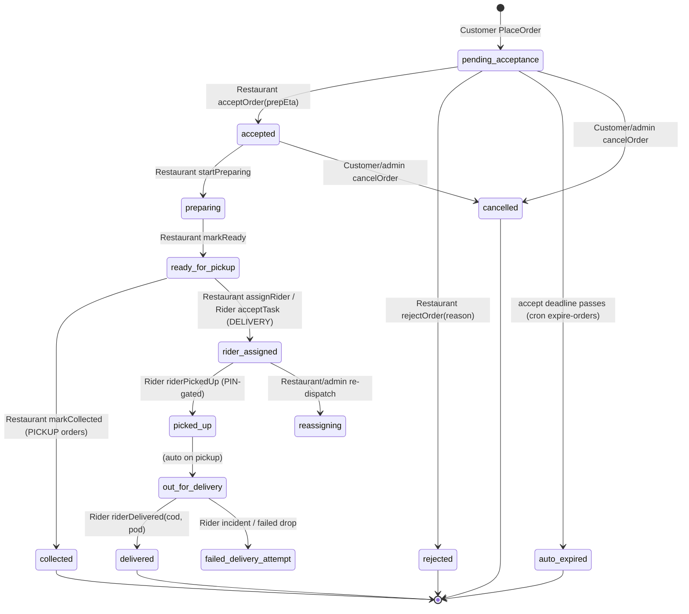
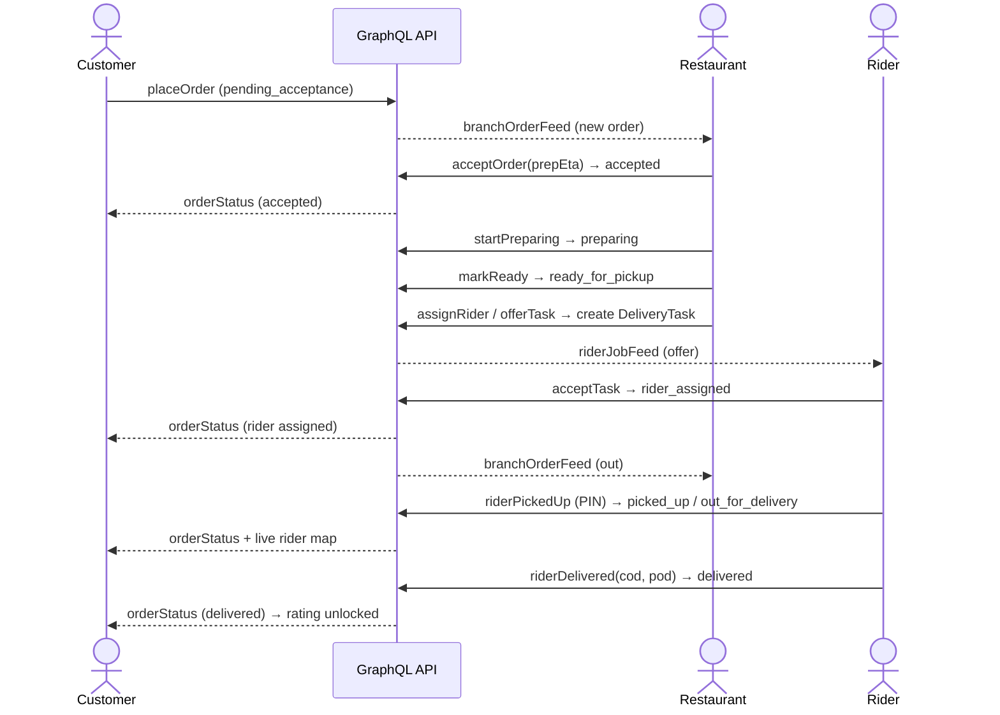

# Herald Eats — User Journey & Flow Docs

This folder documents **every page, button, user interaction, and backend hand-off** across the
three Herald Eats front-ends. It exists so that:

- **QA** can walk each screen action-by-action and know the expected result (including empty / error
  / guard states).
- **Product / engineering** can spot **gaps and broken flows** — each doc has a "Gaps & open issues"
  section cross-linked to GitHub.
- **Anyone** can see **how the three apps are wired together through the backend** — e.g. what a
  customer "Place order" tap does on the restaurant and rider side.

Herald Eats is a single Next.js app (`apps/web`) with a GraphQL API (`apps/api`, mounted inside web
in production) and a Prisma/Postgres database (`packages/db`). The three "apps" are really three
route groups sharing one backend, one auth session, and one order object.

## The three docs

| Doc                            | Audience / surface                | Routes                                                                                                |
| ------------------------------ | --------------------------------- | ----------------------------------------------------------------------------------------------------- |
| [customer.md](customer.md)     | Diners ordering food              | `/`, `/r/*`, `/search`, `/cart`, `/checkout`, `/orders/*`, `/account`, `/wallet`, `/help/*`, `/login` |
| [restaurant.md](restaurant.md) | Restaurant owners & kitchen staff | `/restaurant/*`                                                                                       |
| [rider.md](rider.md)           | Delivery riders                   | `/rider/*`                                                                                            |

> There is also an **admin / ops console** at `/admin/*` (approvals, KYC, refunds, tickets, payouts,
> metrics). It is referenced where it participates in a flow but is not one of the three role docs.

## How to read a flow doc

Each doc follows the same shape:

1. **App mindmap** — a Mermaid mind-map of the surface (pages → key actions).
2. **Page-by-page reference** — for every page: purpose, interactive elements, the exact GraphQL
   operation each action calls, the backend effect, navigation, and empty/error/guard states.
3. **End-to-end journeys** — Mermaid flow / sequence / state diagrams for the important paths.
4. **Cross-role hand-offs** — what this role's actions trigger in the other apps (cross-linked).
5. **QA checklist** — concrete things to test.
6. **Gaps & open issues** — known missing / partial / broken behaviour, linked to GitHub.

Mermaid diagrams render natively on GitHub. Cross-references use relative links + anchors, e.g.
[Restaurant › Orders board](restaurant.md#1-orders-board--restaurantorders).

---

## Shared reference: the order lifecycle (the spine that connects all three apps)

Everything below is the **single source of truth** the three docs point back to. When a role doc says
"the order moves to `ready_for_pickup`", this is what that means everywhere.

### Order status (`OrderStatus` enum — `packages/db/prisma/schema.prisma`)

```
pending_acceptance  → accepted        → preparing → ready_for_pickup
                    → rejected                       → rider_assigned → picked_up → out_for_delivery → delivered
                    → auto_expired                   → reassigning                → failed_delivery_attempt
cancelled  (customer/admin, only while early)
```

Exact values: `pending_acceptance`, `accepted`, `rejected`, `auto_expired`, `preparing`,
`ready_for_pickup`, `rider_assigned`, `reassigning`, `picked_up`, `out_for_delivery`, `delivered`,
`failed_delivery_attempt`, `cancelled`.

### Delivery task status (`DeliveryTaskStatus`)

`unassigned` → `offered` → `assigned` → `arrived_pickup` → `picked_up` → `delivered` (or `failed`).

### Delivery offer status (`DeliveryOfferStatus`)

`pending` → `accepted` / `declined` / `expired` / `withdrawn`. (Shared-offer TTL =
`OFFER_TTL_SECONDS = 20` in `apps/api/src/services/dispatchService.ts`; single-rider `offerTask`
offers are reclaimed by a background sweeper.)

### Canonical cross-role state machine



`collected` is the pickup terminal represented via `delivered` in the schema; the customer UI labels
it "Collected". `markCollected` is the pickup hand-off; delivery orders never hit it.

### Who drives each transition

| Transition                         | Driven by        | Mutation                                             | Realtime signal to others            |
| ---------------------------------- | ---------------- | ---------------------------------------------------- | ------------------------------------ |
| create → `pending_acceptance`      | Customer         | `placeOrder`                                         | `branchOrderFeed` → restaurant board |
| → `accepted` / `rejected`          | Restaurant       | `acceptOrder` / `rejectOrder`                        | `orderStatus` → customer tracking    |
| → `preparing`                      | Restaurant       | `startPreparing`                                     | `orderStatus` → customer             |
| → `ready_for_pickup`               | Restaurant       | `markReady` (does **not** create a task)             | `orderStatus` → customer             |
| create `DeliveryTask` (dispatch)   | Restaurant/Admin | `assignRider` / `offerTask` / `generateSharedOffers` | `riderJobFeed` → rider               |
| → `rider_assigned`                 | Restaurant/Rider | `assignRider` / `acceptTask`                         | `orderStatus` + `branchOrderFeed`    |
| → `picked_up` / `out_for_delivery` | Rider            | `riderPickedUp`                                      | `orderStatus` (live map unlocks)     |
| → `delivered`                      | Rider            | `riderDelivered`                                     | `orderStatus` → rating unlocked      |
| → `cancelled`                      | Customer / Admin | `cancelOrder`                                        | `orderStatus` + `branchOrderFeed`    |

### Realtime channels (GraphQL Subscriptions)

| Subscription                | Consumer                | Fires on                           |
| --------------------------- | ----------------------- | ---------------------------------- |
| `orderStatus(orderId)`      | Customer tracking page  | any status change on that order    |
| `branchOrderFeed(branchId)` | Restaurant orders board | any order change in the branch     |
| `riderJobFeed`              | Rider home              | any job/task change for that rider |
| `notificationFeed`          | Any signed-in user      | new in-app notification            |

All three UIs also keep a **30s fallback poll** in case the SSE/WebSocket stream drops.

### Cross-role happy-path sequence



---

## Money, identity & other shared concepts

- **Auth:** phone + OTP only (`requestOtp` → `verifyOtp`). One `User` can hold multiple roles
  (customer, restaurant_owner, restaurant_staff, rider, admin). Guest checkout runs the same OTP
  inline. See each doc's auth section.
- **Amounts** are stored in **minor units** (paisa); `×100` on the way in, `/100` for display (Rs).
- **Payments** are mocked (`MockProvider`) pending a real PSP — see
  [#17](https://github.com/Hassanjkhan99/food-delivery/issues/17). Modes: COD, wallet, card.
- **Uploads** (menu photos, KYC, POD) go through `presignUpload` → PUT → `finalizeUpload`. Storage is
  local `/tmp` in dev, R2 gated behind env — see
  [#142](https://github.com/Hassanjkhan99/food-delivery/issues/142),
  [#193](https://github.com/Hassanjkhan99/food-delivery/issues/193).
- **Notifications** (WhatsApp / push / SMS) pipeline is built but OFF by default —
  [#13](https://github.com/Hassanjkhan99/food-delivery/issues/13). In-app notification center works.

## Legend for the diagrams

- **Rounded box** = page / screen.
- **Rectangle** = action / mutation.
- **Diamond** = decision / guard.
- `mutation()` in monospace = the exact GraphQL operation in code.
- 🔗 = cross-role hand-off (jump to another doc).
- ⚠️ = known gap / open issue.
