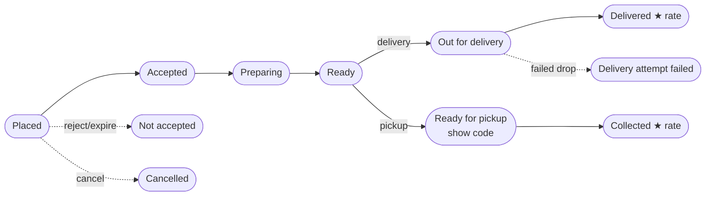
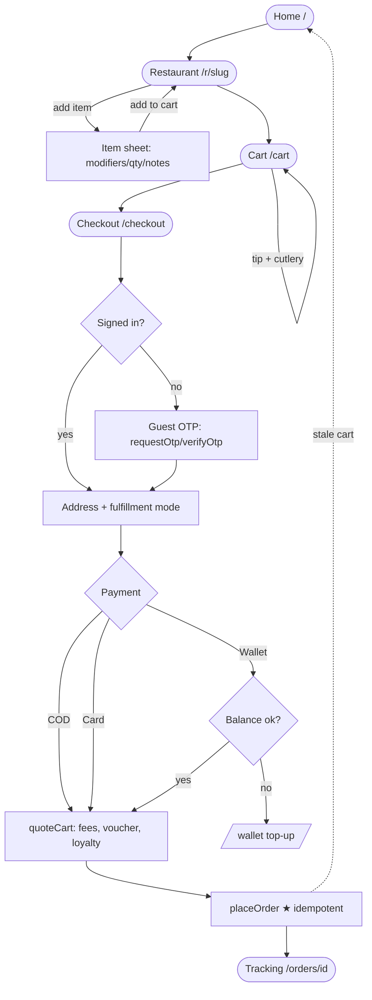
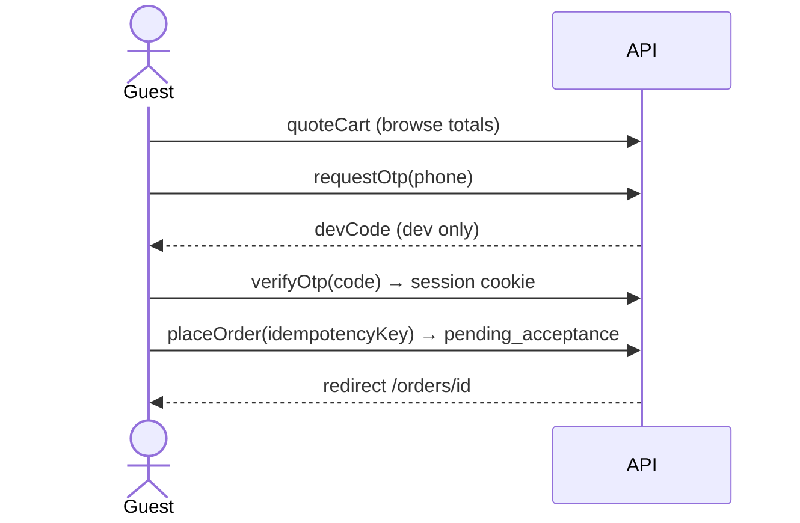

# Customer App — User Journeys & Flows

Surface for diners: browse → order → track → get help. Route group
`apps/web/src/app/(customer)/` plus `/login`. One GraphQL backend shared with
[restaurant](restaurant.md) and [rider](rider.md); order lifecycle & realtime channels are defined in
the [shared reference](README.md#shared-reference-the-order-lifecycle-the-spine-that-connects-all-three-apps).

- [App mindmap](#app-mindmap)
- [Page-by-page reference](#page-by-page-reference)
- [Key journeys](#key-journeys)
- [Cross-role hand-offs](#cross-role-hand-offs)
- [QA checklist](#qa-checklist)
- [Gaps & open issues](#gaps--open-issues)

---

## App mindmap

```mermaid
mindmap
  root((Customer app))
    Discover
      Home /
        Address / location picker
        Cuisine filters + sort
        Promo carousel
        Order-again rail
        Featured / top-rated / free-delivery
        Waitlist (out of area)
      Search /search
        Typeahead + recent + popular
        Restaurants tab / Dishes tab
    Restaurant
      Detail /r/[slug]
        Category rail + in-menu search
        Popular / Deals
        Item sheet (modifiers, notes, qty)
        Floating cart bar
        Branch-conflict dialog
      Reviews /r/[slug]/reviews
    Order
      Cart /cart
        Qty / edit / remove
        Tip + cutlery
      Checkout /checkout
        Guest OTP or signed-in
        Address + fulfillment mode
        Payment (COD / wallet / card)
        Voucher + loyalty
        Place order
      Tracking /orders/[id]
        Staged progress
        Live rider map + call
        Pickup PIN / code
        Cancel / rate / reorder
      Orders list /orders
    Account
      Profile /account
        Sessions, loyalty, marketing
      Addresses /addresses
      Payment methods /payment-methods
      Wallet /wallet
      Membership /membership
      Referrals /referrals
      Gift cards /gift-cards
      Notifications /notifications
    Support
      Help /help
      Order help /help/[orderId]
    Auth
      Login /login (OTP)
```

---

## Page-by-page reference

Legend: **Q** = query, **M** = mutation, **S** = subscription. Amounts in minor units (paisa).

### 1. Home — `/`

**Purpose:** Discover restaurants that deliver to the current pinned location, with filters, sorting,
promos, and reorder.

| Element / action                    | Operation                                                          | Backend effect / result                                                                                            |
| ----------------------------------- | ------------------------------------------------------------------ | ------------------------------------------------------------------------------------------------------------------ |
| Load feed                           | **Q** `Home` (`homeBanners`, `featuredBranches`, `browseBranches`) | Filters branches by lat/lng, radius, accepting-orders, open/closed, cuisine, rating, price band                    |
| Detect signed-in (for reorder rail) | **Q** `HomeViewer` (`viewer`)                                      | —                                                                                                                  |
| Order-again rail                    | **Q** `OrderAgain` (`myOrders`, delivered only)                    | Filters to targets that still deliver to current area                                                              |
| Reorder button                      | client (loads items into cart)                                     | No network; validates against current area                                                                         |
| Search bar (Enter)                  | → navigate                                                         | `/search?q=…`                                                                                                      |
| Restaurant card                     | → navigate                                                         | `/r/<slug>`                                                                                                        |
| Waitlist submit (out-of-area)       | **M** `JoinWaitlist` (`joinWaitlist`)                              | Persists email + lat/lng ⚠️ persistence tracked by [#64](https://github.com/Hassanjkhan99/food-delivery/issues/64) |

**States/guards:** `HomeSkeleton` loading; error → "Try again"; empty → waitlist form; offline banner
with cached data. Carousel refetches on focus + 5-min timer to keep open/closed fresh.

### 2. Search — `/search`

**Purpose:** Global restaurant + dish search with typeahead, recents, popular suggestions.

| Element / action                 | Operation                                       | Effect                                                                                                                                                                                               |
| -------------------------------- | ----------------------------------------------- | ---------------------------------------------------------------------------------------------------------------------------------------------------------------------------------------------------- |
| Query (≥2 chars, 250ms debounce) | **Q** `SearchMarketplace` (`searchMarketplace`) | Approved restaurants with active menus within radius. ⚠️ Closed/paused branches are **not** excluded — they still appear and the UI labels them closed when `isOpenNow`/`isAcceptingOrders` is false |
| Restaurant result                | → navigate                                      | `/r/<slug>`                                                                                                                                                                                          |
| Dish result                      | → navigate                                      | `/r/<slug>?item=<dishId>` (auto-opens item sheet)                                                                                                                                                    |
| Recent / popular chip            | client                                          | Sets query, refetches                                                                                                                                                                                |
| Sort dropdown                    | client                                          | Relevance / rating / ETA / price (client-side sort)                                                                                                                                                  |

**States:** idle → recents + popular; loading skeleton; zero-result → "Did you mean" + browse home.

### 3. Restaurant detail — `/r/[slug]`

**Purpose:** Browse a branch's menu, customise items, build cart.

| Element / action                       | Operation                             | Effect                                                      |
| -------------------------------------- | ------------------------------------- | ----------------------------------------------------------- |
| Load                                   | **Q** `BranchDetail` (`branchBySlug`) | Menu, items, modifiers, combos, theme, layout, availability |
| Category rail / in-menu search         | client                                | Scroll-sync; filter items                                   |
| Quick-add / open item sheet            | client                                | Opens modifier/qty/notes/unavailability sheet               |
| Add to cart (sheet submit)             | client (Zustand)                      | No network; floating cart bar count updates                 |
| Deep-link `?item=<id>`                 | client                                | Auto-opens item sheet                                       |
| Edit-from-cart `?edit=<lineId>`        | client                                | Pre-fills saved modifiers                                   |
| Switch restaurant while cart has items | client dialog                         | Branch-conflict dialog → clear cart to proceed              |
| Cart bar                               | → navigate                            | `/cart`                                                     |
| Reviews link                           | → navigate                            | `/r/<slug>/reviews`                                         |

**States/guards:** loading skeleton; not-found; **closed-by-hours / paused overlay disables quick-add**
(but home may still advertise it ⚠️ [#63](https://github.com/Hassanjkhan99/food-delivery/issues/63));
out-of-radius is enforced at checkout, not here.

### 4. Restaurant reviews — `/r/[slug]/reviews`

**Purpose:** Read customer ratings/reviews (auto-approved) and restaurant public replies. Read-only
for the customer. Replies authored on [Restaurant › Reviews](restaurant.md#9-reviews--restaurantreviews).

### 5. Cart — `/cart`

**Purpose:** Review lines, adjust, add tip & cutlery. **100% client-side (Zustand)** — no network.

| Element / action   | Operation  | Effect                                 |
| ------------------ | ---------- | -------------------------------------- |
| Qty +/- , remove   | client     | Updates `fd-cart` store                |
| Edit line          | → navigate | `/r/<slug>?edit=<lineId>`              |
| Tip chips / custom | client     | `fd-cart-extras` store                 |
| Cutlery toggle     | client     | `fd-cart-extras` store (on by default) |
| Go to checkout     | → navigate | `/checkout`                            |

**States:** empty → "Your cart is empty" + browse link. Estimated total excludes tax/fees (computed
at checkout).

### 6. Checkout — `/checkout`

**Purpose:** Verify identity, set address & fulfillment, choose payment, apply promo/loyalty, place
order. This is the **order-creation choke point**.

| Element / action                       | Operation                                                       | Effect                                                                                                                     |
| -------------------------------------- | --------------------------------------------------------------- | -------------------------------------------------------------------------------------------------------------------------- |
| Detect viewer / prefill                | **Q** `CheckoutViewer` (`viewer`)                               | Skip OTP if signed in                                                                                                      |
| Load payment methods + wallet          | **Q** `CheckoutPaymentMethods` (`myPaymentMethods`, `myWallet`) | —                                                                                                                          |
| Guest: send code                       | **M** `GuestRequestOtp` (`requestOtp`)                          | Returns devCode in dev                                                                                                     |
| Guest: verify                          | **M** `GuestVerifyOtp` (`verifyOtp`)                            | Sets session, unlocks form                                                                                                 |
| Recompute totals (on any input change) | **M** `CheckoutQuote` (`quoteCart`)                             | Validates cart, delivery fee, membership discount, voucher, loyalty, in-radius, min-order                                  |
| Apply promo (explicit)                 | via `quoteCart` input                                           | Server returns `voucherError` code on failure                                                                              |
| Loyalty redeem checkbox                | via `quoteCart`                                                 | Server clamps to balance/subtotal                                                                                          |
| Save new address (opt)                 | **M** `SaveAddress` (`saveAddress`)                             | Best-effort                                                                                                                |
| Lazy-capture name (opt)                | **M** `CheckoutUpdateProfile` (`updateProfile`)                 | Best-effort                                                                                                                |
| **Place order**                        | **M** `PlaceOrder` (`placeOrder`, idempotencyKey)               | **Creates Order `pending_acceptance`**, snapshots items/prices/modifiers/combos, assigns pickup code (pickup), clears cart |

**States/guards:** empty cart → "Nothing to check out"; quote stale → submit disabled; stale cart
(branch gone / item unavailable) → clears + redirect `/`; insufficient wallet → warning + top-up link;
**unauthenticated users are not bounced to `/login`** — the page renders the inline guest OTP flow and
keeps the Place order button disabled until phone verification succeeds (see the guest-checkout journey
below).

🔗 On success → `/orders/<id>`; the order now appears on
[Restaurant › Orders board](restaurant.md#1-orders-board--restaurantorders) via `branchOrderFeed`.

### 7. Orders list — `/orders`

| Element / action                            | Operation                     | Effect                                     |
| ------------------------------------------- | ----------------------------- | ------------------------------------------ |
| Load                                        | **Q** `MyOrders` (`myOrders`) | Orders newest-first with status + snapshot |
| Order card                                  | → navigate                    | `/orders/<id>`                             |
| Reorder (delivered/cancelled/rejected only) | client                        | Loads snapshot into cart                   |
| Help link                                   | → navigate                    | `/help/<orderId>`                          |

### 8. Order tracking — `/orders/[id]`

**Purpose:** Live tracking, rider contact, codes, cancel, rate, help.

| Element / action                                | Operation                               | Effect                                           |
| ----------------------------------------------- | --------------------------------------- | ------------------------------------------------ |
| Load                                            | **Q** `OrderDetail` (`order`)           | Full order, items, events, assigned rider        |
| Live updates                                    | **S** `OrderStatusFeed` (`orderStatus`) | Auto-refetch on status change; 30s fallback poll |
| Cancel (only `pending_acceptance` / `accepted`) | **M** `CancelOrder` (`cancelOrder`)     | → `cancelled`, refund path                       |
| Rate (after `delivered`)                        | **M** `RateOrder` (`rateOrder`)         | Stars + tags + comment                           |
| Rider call (when out for delivery)              | `tel:` link                             | Uses `assignedRider.phone`                       |
| Reorder / Help                                  | client / navigate                       | cart / `/help/<id>`                              |

**Staged progress (customer view):** Placed → Accepted → Preparing → Ready → Out for delivery →
Delivered. Pickup variant ends at **Ready for pickup → Collected** (shows pickup code). Terminal
unhappy states (`rejected`, `auto_expired`, `cancelled`, `failed_delivery_attempt`) override the
timeline with an explanatory notice.



**Live rider map + pickup PIN:** map + call appear only while `picked_up` / `out_for_delivery`; rider
location comes from [rider pings](rider.md#go-online--location-flow-163). Pickup PIN is shown to the
customer while the rider is en route to collect (fraud control
[#25](https://github.com/Hassanjkhan99/food-delivery/issues/25)).

### 9. Help — `/help`

Static FAQ accordion + pointer to order-specific help + support email. No network.

### 10. Order help — `/help/[orderId]`

| Element / action | Operation                                      | Effect                                            |
| ---------------- | ---------------------------------------------- | ------------------------------------------------- |
| Load             | **Q** `OrderHelp` (`order`, `ticketsForOrder`) | Order recap + existing tickets                    |
| File ticket      | **M** `CreateHelpTicket` (`createHelpTicket`)  | Creates ticket; may auto-start refund by category |

🔗 Tickets surface on [Restaurant › Support](restaurant.md#17-support--restaurantsupport) and the admin
ticket queue.

### 11. Account — `/account`

| Element / action         | Operation                                                  | Effect                   |
| ------------------------ | ---------------------------------------------------------- | ------------------------ |
| Load profile + sessions  | **Q** `AccountViewer` (`viewer`, `mySessions`)             | —                        |
| Loyalty balance + ledger | **Q** `AccountLoyalty` (`loyaltyAccount`, `loyaltyLedger`) | —                        |
| Edit profile             | **M** `AccountUpdateProfile` (`updateProfile`)             | Name/email (null clears) |
| Marketing toggle         | **M** `SetMarketingOptOut` (`setMarketingOptOut`)          | —                        |
| Revoke device            | **M** `RevokeSession` (`revokeSession`)                    | —                        |
| Sign out                 | **M** `Logout` (`logout`)                                  | Clears urql cache → `/`  |

Links out to wallet / payment-methods / membership / referrals / gift-cards.

### 12. Addresses — `/addresses`

CRUD over `myAddresses`: **M** `SaveAddress`, `UpdateAddress` (preserves pin), `DeleteAddress`.

### 13. Payment methods — `/payment-methods`

`myPaymentMethods`; **M** `AddPaymentMethod` (mock gateway; 4242…=ok, 4000…=decline),
`RemovePaymentMethod`.

### 14. Wallet — `/wallet`

`myWallet` (balance + transactions); **M** `TopUpWallet` (charges saved card). Feeds COD/wallet
payment at checkout.

### 15. Membership (Herald/KhaanaDo Pro) — `/membership`

`membershipPlans` / `myMembership`; **M** `SubscribeMembership`, `CancelMembership`. Grants
free/discounted delivery reflected in `quoteCart`. ⚠️ Auto-renewal is groundwork only
([#59](https://github.com/Hassanjkhan99/food-delivery/issues/59)).

### 16. Referrals — `/referrals`

`myReferral`; **M** `ApplyReferralCode` (before first order; credit lands after first delivery).
([#58](https://github.com/Hassanjkhan99/food-delivery/issues/58))

### 17. Gift cards — `/gift-cards`

`myGiftCards` + wallet; **M** `PurchaseGiftCard` (idempotent), `RedeemGiftCard` → wallet.
([#60](https://github.com/Hassanjkhan99/food-delivery/issues/60))

### 18. Notifications — `/notifications`

`myNotifications` + `unreadNotificationCount`; **M** `MarkAllNotificationsRead`,
`MarkNotificationRead`. In-app inbox works; push/WhatsApp/SMS delivery is gated
([#13](https://github.com/Hassanjkhan99/food-delivery/issues/13),
[#56](https://github.com/Hassanjkhan99/food-delivery/issues/56)).

### 19. Login — `/login`

Two-step OTP: **M** `RequestOtp` → **M** `VerifyOtp`. Rate limit 6/hr per phone; dev shows code;
redirects to `home` or `?next=`.

---

## Key journeys

### Order placement (browse → track)



### Guest checkout (inline, no `/login` bounce)



---

## Cross-role hand-offs

| Customer action                     | Immediately triggers              | Where it shows up                                                                                      |
| ----------------------------------- | --------------------------------- | ------------------------------------------------------------------------------------------------------ |
| `placeOrder` → `pending_acceptance` | `branchOrderFeed`                 | 🔗 [Restaurant board "New" lane](restaurant.md#1-orders-board--restaurantorders) with accept countdown |
| Waits on tracking                   | `orderStatus` subscription        | Reflects restaurant accept/prepare/ready + rider pickup/deliver                                        |
| `cancelOrder`                       | `orderStatus` + `branchOrderFeed` | Restaurant board "Recent"; refund path                                                                 |
| `createHelpTicket`                  | ticket created                    | 🔗 [Restaurant › Support](restaurant.md#17-support--restaurantsupport) + admin queue                   |
| `rateOrder` after delivery          | rating stored                     | 🔗 [Restaurant › Reviews](restaurant.md#9-reviews--restaurantreviews) (owner can reply)                |
| Live rider map                      | reads rider pings                 | 🔗 fed by [Rider location pings](rider.md#go-online--location-flow-163)                                |

See the full picture in the [shared cross-role sequence](README.md#cross-role-happy-path-sequence).

---

## QA checklist

**Discovery**

- [ ] Out-of-area location shows waitlist, not a broken empty feed.
- [ ] Closed / paused restaurant: quick-add disabled and label shows opening time. ⚠️ Home should not
      advertise an order it can't honor ([#63](https://github.com/Hassanjkhan99/food-delivery/issues/63)).
- [ ] Order-again rail hides restaurants that no longer deliver to the current pin.
- [ ] Search <2 chars shows recents/popular; zero results shows "Did you mean".
- [ ] Dish deep-link `?item=` opens the correct item sheet.

**Cart & checkout**

- [ ] Adding from a second restaurant triggers the branch-conflict dialog.
- [ ] Tip + cutlery persist across navigation and reflect in the quote.
- [ ] Voucher: valid applies; invalid shows the correct `voucherError` message.
- [ ] Loyalty redeem clamps to balance and never makes total negative.
- [ ] Wallet payment blocked + top-up prompt when balance insufficient.
- [ ] **Double-tap Place order does not create two orders** (idempotency key).
- [ ] Stale cart (item 86'd / branch gone) is caught and the user is redirected, not charged.
- [ ] Guest OTP path completes an order without visiting `/login`.

**Tracking & post-order**

- [ ] Status transitions arrive live (kill the tab, reopen — 30s poll recovers state).
- [ ] Cancel is only offered while `pending_acceptance` / `accepted`.
- [ ] Pickup order shows a pickup code; delivery order shows rider card + map when out for delivery.
- [ ] Rating sheet appears only after `delivered`.
- [ ] Failed delivery attempt shows the warning notice, not a stuck "out for delivery".

**Account**

- [ ] Logout clears cache (no stale orders/viewer on a shared browser).
- [ ] Address edit preserves the map pin; new address captures current location.

---

## Gaps & open issues

| Area                                                              | Status                      | Issue                                                             |
| ----------------------------------------------------------------- | --------------------------- | ----------------------------------------------------------------- |
| Tax-inclusive pricing + price-view toggle                         | P0, not fully done          | [#146](https://github.com/Hassanjkhan99/food-delivery/issues/146) |
| Block ordering from closed-by-hours branches (home advertises it) | **bug**                     | [#63](https://github.com/Hassanjkhan99/food-delivery/issues/63)   |
| Persist "notify me" waitlist emails                               | enhancement                 | [#64](https://github.com/Hassanjkhan99/food-delivery/issues/64)   |
| Phone input validation / PK normalization / gate submit           | P1                          | [#148](https://github.com/Hassanjkhan99/food-delivery/issues/148) |
| Home discovery filters / sorting / personalization                | P0                          | [#51](https://github.com/Hassanjkhan99/food-delivery/issues/51)   |
| Voucher / promo-code engine                                       | P0                          | [#52](https://github.com/Hassanjkhan99/food-delivery/issues/52)   |
| Fulfillment modes: pickup + scheduled orders                      | P1 (scheduled = groundwork) | [#54](https://github.com/Hassanjkhan99/food-delivery/issues/54)   |
| Wallet top-up / pay / refund-to-wallet                            | P1                          | [#55](https://github.com/Hassanjkhan99/food-delivery/issues/55)   |
| Notification & offers inbox                                       | P2                          | [#56](https://github.com/Hassanjkhan99/food-delivery/issues/56)   |
| Loyalty points                                                    | P2                          | [#57](https://github.com/Hassanjkhan99/food-delivery/issues/57)   |
| Referrals                                                         | P2                          | [#58](https://github.com/Hassanjkhan99/food-delivery/issues/58)   |
| Membership auto-renew billing                                     | P2                          | [#59](https://github.com/Hassanjkhan99/food-delivery/issues/59)   |
| Gift cards                                                        | P2                          | [#60](https://github.com/Hassanjkhan99/food-delivery/issues/60)   |
| Saved addresses / guest / reorder / promo banners polish          | P2                          | [#34](https://github.com/Hassanjkhan99/food-delivery/issues/34)   |
| Notifications delivery (WhatsApp/push/SMS)                        | P0, gated OFF               | [#13](https://github.com/Hassanjkhan99/food-delivery/issues/13)   |
| Real PSP (payments are mocked)                                    | P0                          | [#17](https://github.com/Hassanjkhan99/food-delivery/issues/17)   |
| Routing / geocoding / address autocomplete / ETA                  | P1                          | [#27](https://github.com/Hassanjkhan99/food-delivery/issues/27)   |

> UX epics [#37–#45](https://github.com/Hassanjkhan99/food-delivery/issues/38) (search, restaurant
> page, item sheet, cart, checkout, tracking, auth, account, help) are largely **built** per the
> current code but remain open as tracking/QA umbrellas — verify against this doc before closing.
