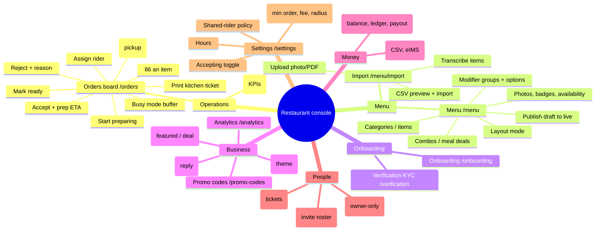
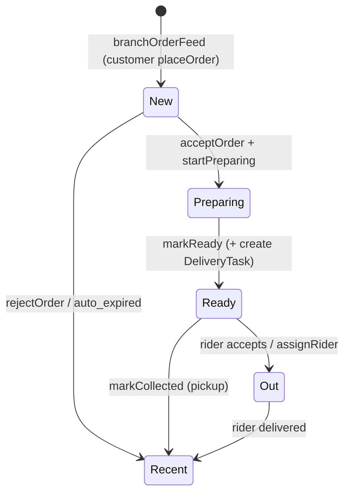
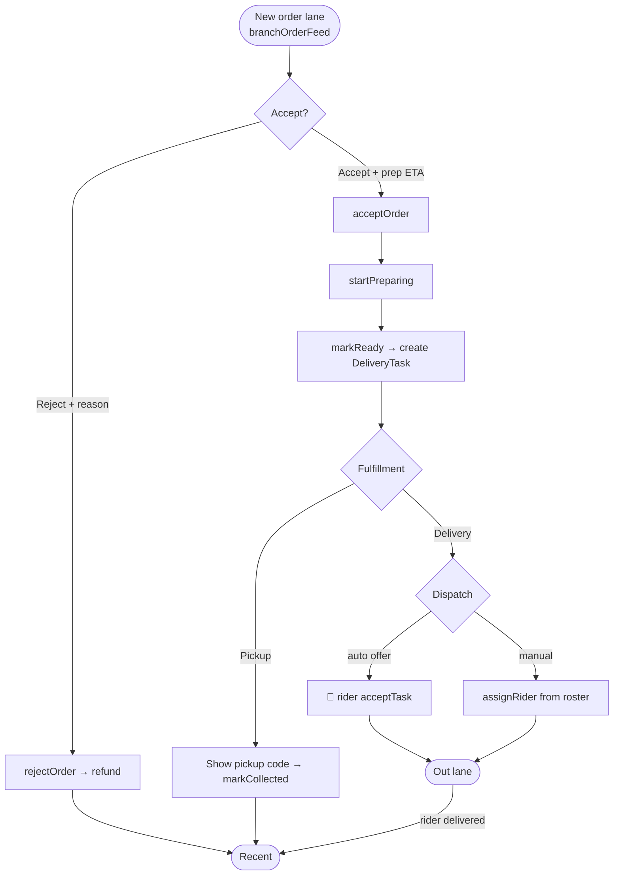
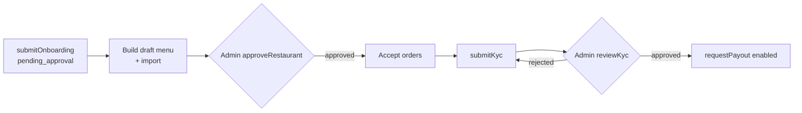

# Restaurant Console — User Journeys & Flows

Surface for restaurant owners and kitchen staff. Route group `apps/web/src/app/restaurant/`
(root `/restaurant` redirects to `/restaurant/orders`). Shares one backend with
[customer](customer.md) and [rider](rider.md); the order lifecycle & realtime channels live in the
[shared reference](README.md#shared-reference-the-order-lifecycle-the-spine-that-connects-all-three-apps).

- [App mindmap](#app-mindmap)
- [Roles & access](#roles--access)
- [Page-by-page reference](#page-by-page-reference)
- [Key journeys](#key-journeys)
- [Cross-role hand-offs](#cross-role-hand-offs)
- [QA checklist](#qa-checklist)
- [Gaps & open issues](#gaps--open-issues)

---

## App mindmap

---

## Roles & access

| Role               | Can see                                                                |
| ------------------ | ---------------------------------------------------------------------- |
| `restaurant_owner` | Everything                                                             |
| `restaurant_staff` | **Orders + Today only** (menu, money, staff, settings hidden)          |
| `admin`            | Approval queues (restaurant, KYC, campaign, rider) — see admin console |

Nav is gated in `layout.tsx` (`isOwner ? NAV : NAV.filter(staff)`); each page also re-checks
membership/ownership server-side. Unbuilt-restaurant users are redirected to onboarding.

---

## Page-by-page reference

Legend: **Q** query, **M** mutation, **S** subscription.

### 1. Orders board — `/restaurant/orders`

**Purpose:** Live kitchen queue — the operational heart of the console.

**Layout:** 6 lanes — **Scheduled → New → Preparing → Ready → Out → Recent**.

| Element / action                      | Operation                                                    | Backend effect                                                                                                                                        |
| ------------------------------------- | ------------------------------------------------------------ | ----------------------------------------------------------------------------------------------------------------------------------------------------- |
| Load board                            | **Q** `boardOrders(branchId, statuses)`                      | Orders grouped into lanes                                                                                                                             |
| Live new-order push                   | **S** `branchOrderFeed(branchId)`                            | Refetch on any change; 30s fallback poll                                                                                                              |
| New-order alarm                       | `useOrderAlarm` (client)                                     | Sound + tab flash + banner when pending count rises                                                                                                   |
| **Accept** (AcceptSheet → prep chips) | **M** `acceptOrder(id, prepEtaMinutes)`                      | `pending_acceptance → accepted`; ETA set; 🔗 customer sees "Accepted"                                                                                 |
| **Reject** (RejectSheet → reason)     | **M** `rejectOrder(id, reason)`                              | `→ rejected`; refund path                                                                                                                             |
| Start preparing                       | **M** `startPreparing(id)`                                   | `accepted → preparing`                                                                                                                                |
| **Mark ready**                        | **M** `markReady(id)`                                        | `preparing/accepted → ready_for_pickup`; **creates DeliveryTask → 🔗 [rider offer](rider.md#job-lifecycle)** (delivery) or shows pickup code (pickup) |
| Assign rider (dropdown, delivery)     | **M** `assignRider(orderId, riderId)`                        | Directly assigns a roster rider → `rider_assigned`                                                                                                    |
| Mark collected (pickup)               | **M** `markCollected(id)`                                    | Pickup terminal                                                                                                                                       |
| 86 an item (EightySixSheet)           | **M** `setItemAvailability(itemId, available:false, until?)` | Item hidden from customer menu + cart validation; optional auto-restore                                                                               |
| Busy mode +10/20/30/clear             | **M** `setBusyMode(branchId, bufferMinutes)`                 | Buffer added to all prep ETAs customer sees                                                                                                           |
| Print ticket                          | client `printKitchenTicket`                                  | —                                                                                                                                                     |

**Card shows:** code, payment badge (COD/PAID), total, customer name, fulfillment + scheduled badge,
items, per-line unavailability preference, customer phone (if "contact me"), note, "no cutlery" flag.

**Guards/states:** no restaurant → skeleton + onboarding link; not approved → "Complete onboarding";
paused → red "Not accepting orders" badge; empty lanes show "(0)".

### 2. Today — `/restaurant/today`

**Q** `todaySummary(branchId)` → Orders count, Revenue (accepted), Acceptance %, Top items (5).
Polls every 30s. Empty → "No items sold yet today."

### 3. Menu — `/restaurant/menu`

**Purpose:** Edit the **draft** menu, then publish it live.

| Action                            | Operation                                                         |
| --------------------------------- | ----------------------------------------------------------------- |
| Load draft                        | **Q** `draftMenu(branchId)`                                       |
| Category upsert / (delete via UI) | **M** `upsertCategory`                                            |
| Item upsert / delete              | **M** `upsertMenuItem` / `deleteMenuItem`                         |
| Item availability                 | **M** `setItemAvailability`                                       |
| Item photo                        | **M** `setMenuItemPhoto` (after `presignUpload`→`finalizeUpload`) |
| Modifier group upsert / delete    | **M** `upsertModifierGroup` / `deleteModifierGroup`               |
| Modifier option upsert / delete   | **M** `upsertModifierOption` / `deleteModifierOption`             |
| Combo upsert / delete             | **M** `upsertCombo` / `deleteCombo`                               |
| Combo items                       | **M** `addComboItem` / `removeComboItem` / `setComboAvailability` |
| Layout mode                       | **M** `updateMenuLayout(branchId, layoutJson)`                    |
| **Publish**                       | **M** `publishMenu(branchId)` → clones draft to live              |

**Guard:** modifiers/combos require the item to be **saved first**. ⚠️ `setBranchHours` /
`submitOnboarding` relation-return bug tracked in
[#151](https://github.com/Hassanjkhan99/food-delivery/issues/151).

### 4. Menu import — `/restaurant/menu/import`

| Action                           | Operation                                                                        |
| -------------------------------- | -------------------------------------------------------------------------------- |
| Upload photo/PDF reference       | **M** `registerMenuSourceDoc(branchId, assetId, kind)` (+ `menuSourceDocs` list) |
| Transcribe item / quick category | **M** `upsertMenuItem` / `upsertCategory`                                        |
| CSV preview                      | **M** `previewMenuCsv(assetId)` (validates rows)                                 |
| CSV import                       | **M** `importMenuCsvToDraft(branchId, assetId)` → `{created, updated}`           |

⚠️ Automatic OCR of photo/PDF menus is **not built** —
[#177](https://github.com/Hassanjkhan99/food-delivery/issues/177),
[#23](https://github.com/Hassanjkhan99/food-delivery/issues/23).

### 5. Onboarding — `/restaurant/onboarding`

**M** `submitOnboarding(name, addressText, lat, lng, minOrderMinor, deliveryFeeMinor,
deliveryRadiusM)` → creates restaurant + branch (`pending_approval`). Location is pinned to
`DEFAULT_LOCATION` in the pilot. Success → "Set up my menu" CTA (menu editable before approval).

### 6. Verification (KYC) — `/restaurant/verification` (owner-only)

**Q** `restaurantKyc(restaurantId)`; **M** `submitKyc(...ownerName, ownerCnic, bankAccountName,
bankIban, cnicAssetId)`. Status: submitted → approved/rejected (admin). **Restaurant can't be paid out
until KYC approved.**

### 7. Settings — `/restaurant/settings`

| Action              | Operation                                                                                                                                         |
| ------------------- | ------------------------------------------------------------------------------------------------------------------------------------------------- |
| Pause/resume        | **M** `setAcceptingOrders(branchId, accepting)`                                                                                                   |
| Hours (per day)     | **M** `setBranchHours(branchId, hours[])`                                                                                                         |
| Name + cuisine tags | **M** `updateRestaurantProfile(restaurantId, name, cuisineTags)`                                                                                  |
| Commercials         | **M** `updateBranchCommercials(branchId, minOrderMinor, deliveryFeeMinor, deliveryRadiusM)`                                                       |
| Shared-rider policy | **M** `setSharedRiderPolicy(restaurantId, sharingEnabled, maxActiveJobs, maxIncrementalDelaySec, maxPickupMeters, codTrustThreshold, vetoActive)` |

⚠️ Hours **enforcement** (block ordering when closed) is [#19](https://github.com/Hassanjkhan99/food-delivery/issues/19) / [#63](https://github.com/Hassanjkhan99/food-delivery/issues/63).

### 8. Analytics — `/restaurant/analytics`

**Q** `restaurantAnalytics(branchId, days)` → KPIs (orders, revenue, AOV, avg accept time, repeat %),
charts (by day-of-week, by hour, revenue/day, accept-time trend), top/bottom items, cancellation
reasons.

### 9. Reviews — `/restaurant/reviews`

**Q** `restaurantReviews(restaurantId, limit, offset)`; **M** `respondToRating(ratingId, body)` (public
reply). 🔗 Ratings originate from [Customer › rate order](customer.md#8-order-tracking--ordersid).
⚠️ Deeper analytics + review responses epic [#61](https://github.com/Hassanjkhan99/food-delivery/issues/61).

### 10. Branding — `/restaurant/branding`

**Q** theme via `branchBySlug`; **M** `updateTheme(restaurantId, primaryColor, accentColor,
backgroundColor, textColor, fontKey, cardStyle, heroEffect, logoAssetId, heroAssetId)`. Live preview +
WCAG-AA contrast warning. Theme renders on the [customer restaurant page](customer.md#3-restaurant-detail--rslug).

### 11. Campaigns — `/restaurant/campaigns`

**Q** `myCampaigns`, `featuredSlotRate`, `walletBalance`; **M** `createCampaign` → `submitCampaign`
(wallet-balance-gated) → admin approves → `approveCampaign`/`rejectCampaign`; `cancelCampaign`. Types:
featured slot (home feed) / deal badge.

### 12. Promo codes — `/restaurant/promo-codes`

**Q** `restaurantVouchers`; **M** `createRestaurantVoucher(...type: percentage/fixed/free_delivery)`,
`setRestaurantVoucherActive`. Restaurant-funded; applied at [customer checkout](customer.md#6-checkout--checkout).

### 13. Riders — `/restaurant/riders`

**Q** `branchRiders(branchId)`; **M** `inviteRider(branchId, name, phone)`. Roster shows online status,
type, verification, trust score. Invited riders sign in via OTP and appear in the
[rider app](rider.md). Assignment happens on the [orders board](#1-orders-board--restaurantorders).

### 14. Wallet — `/restaurant/wallet`

**Q** `walletBalance`, `walletStatement`, `payoutHistory`; **M** `requestPayout(restaurantId)`
(min Rs 1,000, one pending at a time). Negative balance explained (COD platform fees > card earnings).

### 15. Settlements — `/restaurant/settlements`

**Q** `settlementReportCsv(restaurantId, from, to)`, `eimsInvoiceCsv(branchId, from, to)` → CSV
downloads. ⚠️ PRA/eIMS compliance pack [#18](https://github.com/Hassanjkhan99/food-delivery/issues/18).

### 16. Staff — `/restaurant/staff` (owner-only)

**Q** `restaurantStaff`; **M** `inviteStaff(restaurantId, phone, name)`, `removeStaff`. Staff get
Orders + Today access only.

### 17. Support — `/restaurant/support` (owner-only)

**Q** `restaurantTickets(restaurantId)`; **M** `respondToTicket(ticketId, body)`. 🔗 Tickets come from
[Customer › order help](customer.md#10-order-help--helporderid); replies are visible to the customer.

---

## Key journeys

### Order fulfilment (accept → hand to rider)

### Onboarding → live → payout-eligible

---

## Cross-role hand-offs

| Restaurant action                     | Triggers                              | Where                                                                                                                  |
| ------------------------------------- | ------------------------------------- | ---------------------------------------------------------------------------------------------------------------------- |
| `acceptOrder` / `rejectOrder`         | `orderStatus`                         | 🔗 [Customer tracking](customer.md#8-order-tracking--ordersid)                                                         |
| `markReady` (delivery)                | creates DeliveryTask → `riderJobFeed` | 🔗 [Rider offer/home](rider.md#job-lifecycle)                                                                          |
| `assignRider`                         | task assigned                         | 🔗 [Rider job detail](rider.md#2-job-detail--active-delivery--riderjobstaskid)                                         |
| `setItemAvailability` (86)            | menu updated                          | 🔗 [Customer menu / cart validation](customer.md#3-restaurant-detail--rslug)                                           |
| `respondToRating` / `respondToTicket` | reply published                       | 🔗 [Customer reviews](customer.md#4-restaurant-reviews--rslugreviews) / [help](customer.md#10-order-help--helporderid) |
| `inviteRider`                         | rider account created                 | 🔗 [Rider app](rider.md)                                                                                               |

---

## QA checklist

**Orders board (highest priority — this is live money)**

- [ ] New order fires sound + banner and lands in "New" with an accept countdown.
- [ ] Accept applies busy-mode buffer to the ETA the customer sees.
- [ ] Reject with a reason refunds the customer and moves to "Recent".
- [ ] `markReady` creates a delivery task and it appears as a rider offer within seconds.
- [ ] Pickup order shows a pickup code and `markCollected` closes it (no rider involved).
- [ ] Manual `assignRider` works when no auto-offer is accepted.
- [ ] 86-ing an item removes it from the live customer menu immediately and (if `until`) restores it.
- [ ] Board recovers state after a dropped subscription (30s poll).
- [ ] Staff role sees only Orders + Today.

**Menu**

- [ ] Draft edits are not visible to customers until `publishMenu`.
- [ ] Can't attach a modifier/combo item to an unsaved item.
- [ ] CSV preview flags bad rows; import reports created/updated counts.

**Onboarding / KYC / money**

- [ ] Menu editable while `pending_approval`; ordering blocked until approved.
- [ ] Payout blocked until KYC approved and balance ≥ Rs 1,000; only one pending payout.
- [ ] Settlement + eIMS CSVs download for a date range (empty range = valid empty CSV).

---

## Gaps & open issues

| Area                                                                                                             | Status      | Issue                                                                                                                                |
| ---------------------------------------------------------------------------------------------------------------- | ----------- | ------------------------------------------------------------------------------------------------------------------------------------ |
| Menu OCR (photo/PDF → items)                                                                                     | not built   | [#177](https://github.com/Hassanjkhan99/food-delivery/issues/177), [#23](https://github.com/Hassanjkhan99/food-delivery/issues/23)   |
| Mutation-return relation resolves fail (`submitOnboarding.branches`, `setBranchHours.hours`) + COD wallet sanity | **bug**     | [#151](https://github.com/Hassanjkhan99/food-delivery/issues/151)                                                                    |
| Console v2 (live kitchen control)                                                                                | P0 umbrella | [#46](https://github.com/Hassanjkhan99/food-delivery/issues/46)                                                                      |
| Hours enforcement + holiday/pause schedule                                                                       | P1          | [#19](https://github.com/Hassanjkhan99/food-delivery/issues/19)                                                                      |
| Block ordering from closed branches                                                                              | **bug**     | [#63](https://github.com/Hassanjkhan99/food-delivery/issues/63)                                                                      |
| Modifier group editor depth                                                                                      | P1          | [#20](https://github.com/Hassanjkhan99/food-delivery/issues/20)                                                                      |
| Combos / meal deals / item offers                                                                                | P1          | [#53](https://github.com/Hassanjkhan99/food-delivery/issues/53)                                                                      |
| Vendor review responses + deeper analytics                                                                       | P2          | [#61](https://github.com/Hassanjkhan99/food-delivery/issues/61)                                                                      |
| Dispatch policy controls (dedicated vs external riders)                                                          | epic        | [#103](https://github.com/Hassanjkhan99/food-delivery/issues/103)                                                                    |
| PRA / tax compliance (eIMS, Raast QR)                                                                            | P0          | [#18](https://github.com/Hassanjkhan99/food-delivery/issues/18)                                                                      |
| Promoted deals / featured placements (Campaign UI depth)                                                         | P1          | [#22](https://github.com/Hassanjkhan99/food-delivery/issues/22)                                                                      |
| Uploads off ephemeral /tmp → object storage                                                                      | gated       | [#142](https://github.com/Hassanjkhan99/food-delivery/issues/142), [#193](https://github.com/Hassanjkhan99/food-delivery/issues/193) |

> **Note on scheduled orders:** the "Scheduled" lane and `scheduledFor` exist, but **auto-promotion to
> "New" at `scheduledFor − leadTime` is a noted TODO in `orderService.ts`** — staff must accept
> manually. Tracked under [#54](https://github.com/Hassanjkhan99/food-delivery/issues/54).
