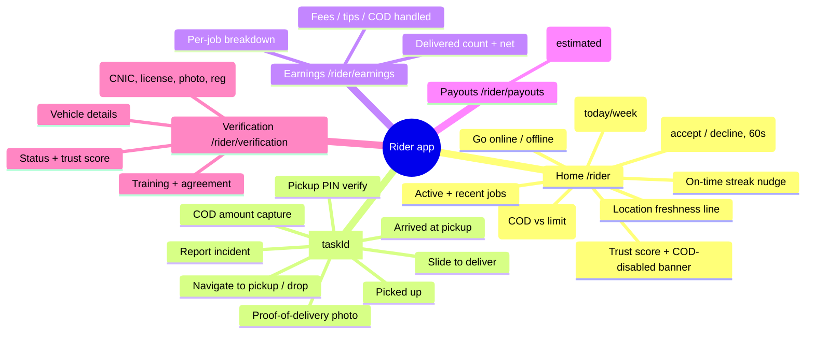
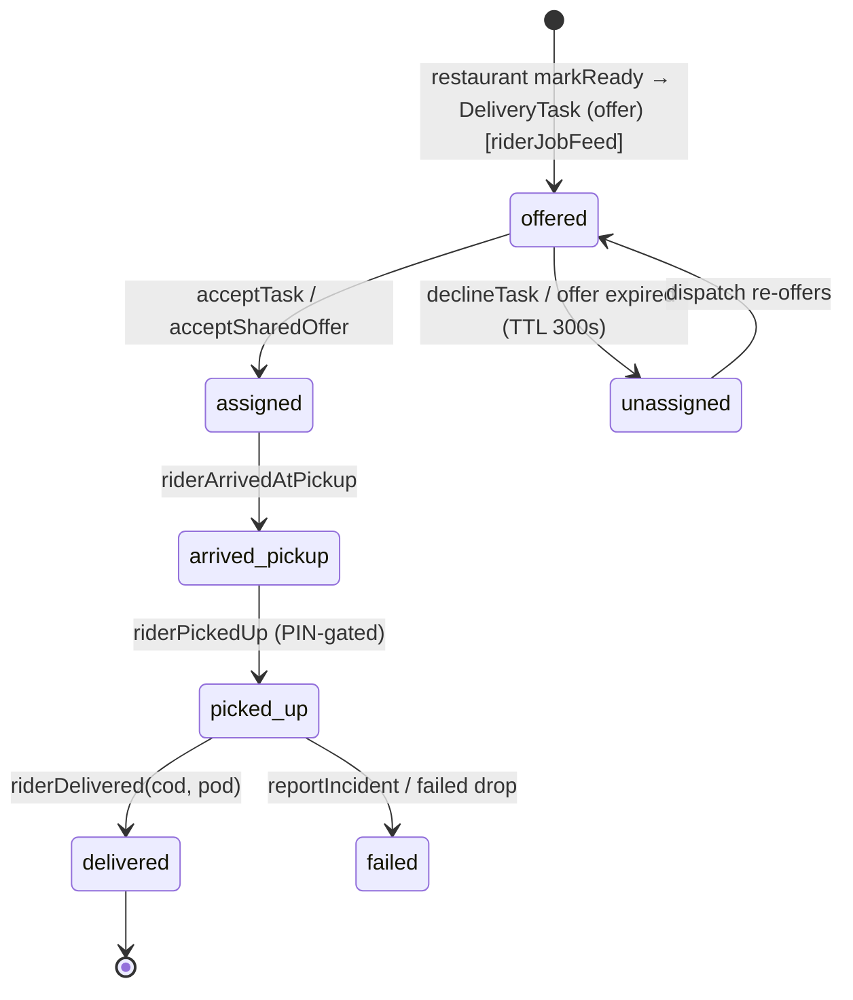
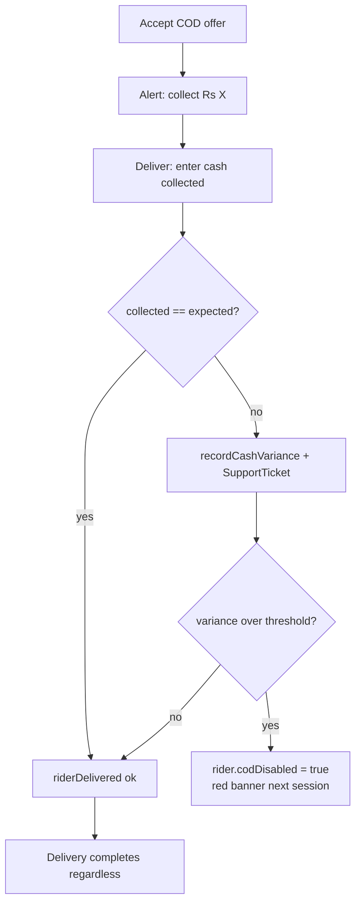
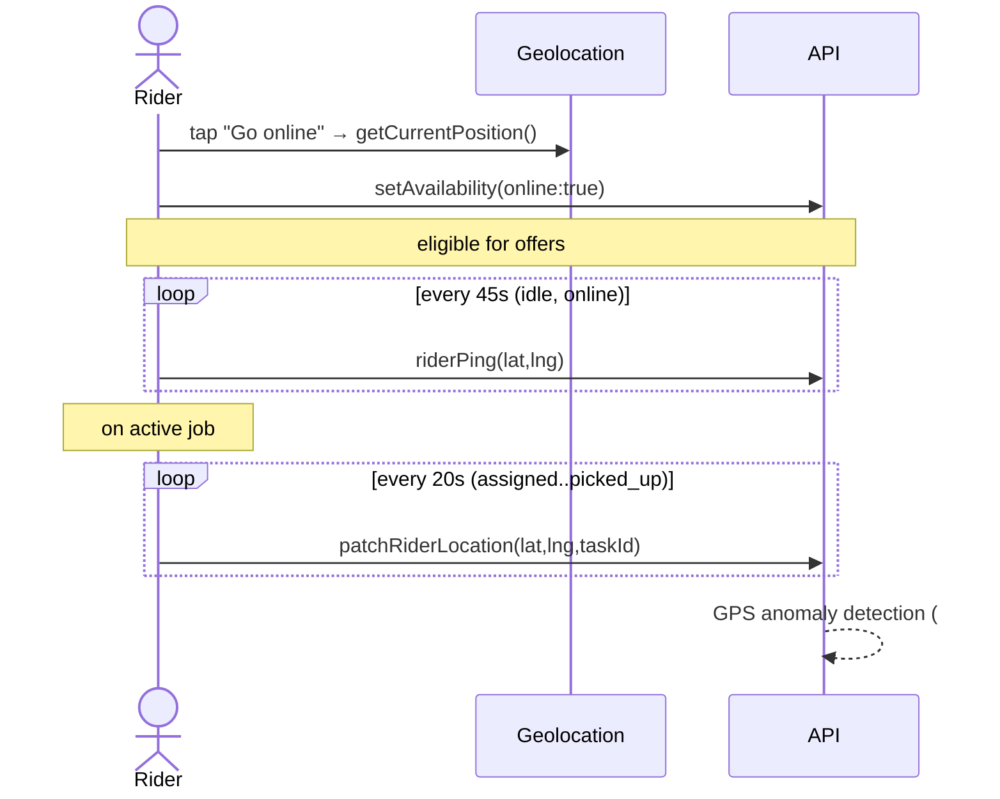

# Rider App — User Journeys & Flows

Surface for delivery riders. Route group `apps/web/src/app/rider/` (mobile-first, max-width 768px).
Shares one backend with [customer](customer.md) and [restaurant](restaurant.md); the order lifecycle,
task/offer states, and realtime channels live in the
[shared reference](README.md#shared-reference-the-order-lifecycle-the-spine-that-connects-all-three-apps).

- [App mindmap](#app-mindmap)
- [Page-by-page reference](#page-by-page-reference)
- [Job lifecycle](#job-lifecycle)
- [Go-online / location flow (#163)](#go-online--location-flow-163)
- [Shared-rider dispatch](#shared-rider-dispatch)
- [Cross-role hand-offs](#cross-role-hand-offs)
- [QA checklist](#qa-checklist)
- [Gaps & open issues](#gaps--open-issues)

---

## App mindmap

---

## Page-by-page reference

Legend: **Q** query, **M** mutation, **S** subscription. All pages require the `rider` role; no
profile → "No rider profile for this account". Load policy `cache-and-network`.

### 1. Home / Jobs — `/rider`

**Purpose:** Availability, cash/earnings/trust status, incoming offers, active & recent jobs.

| Element / action                          | Operation                                                                                             | Effect                                                                  |
| ----------------------------------------- | ----------------------------------------------------------------------------------------------------- | ----------------------------------------------------------------------- |
| Load dashboard                            | **Q** `RiderHome` (`myRiderProfile`, `myCashSummary`, `myEarningsSummary`, `myRiderStreak`, `myJobs`) | Profile, COD-vs-limit, today/week net, streak, jobs                     |
| Live job push                             | **S** `riderJobFeed`                                                                                  | Refetch (network-only) on any job change; 30s fallback poll             |
| **Go online / offline**                   | **M** `setAvailability(online)`                                                                       | Toggles eligibility; going online requests geolocation + starts pings   |
| **Accept offer** (AssignmentAlert, 60s)   | **M** `acceptTask(taskId)`                                                                            | Task `offered → assigned`; 🔗 order `ready_for_pickup → rider_assigned` |
| **Decline offer**                         | **M** `declineTask(taskId, reason)`                                                                   | Task `→ unassigned`; returns to dispatch                                |
| Acknowledge direct assignment (franchise) | client                                                                                                | Dismiss alert (no decline)                                              |
| Idle location heartbeat (45s)             | **M** `riderPing(lat, lng)`                                                                           | Updates `lastLocationAt` for dispatch proximity                         |
| Open job                                  | → navigate                                                                                            | `/rider/jobs/<taskId>`                                                  |
| Earnings / payouts links                  | → navigate                                                                                            | `/rider/earnings`, `/rider/payouts`                                     |

**Signals shown:** trust score + label (Trusted/Good standing/At risk), COD-disabled banner (fraud
freeze), location freshness ("updated Xs ago" / permission denied), on-time streak (≥3), cash fill bar
(green→yellow@80%→red@limit).

**States:** no active jobs → empty copy; offer error → "Offer is no longer available" (race);
location denied → yellow nudge; COD-disabled → red banner + accept blocked on COD offers.

### 2. Job detail / Active delivery — `/rider/jobs/[taskId]`

**Purpose:** Step through one delivery: navigate → pickup (PIN) → deliver (COD + POD).

| Element / action               | Operation                                                      | Effect                                                                                      |
| ------------------------------ | -------------------------------------------------------------- | ------------------------------------------------------------------------------------------- |
| Load                           | **Q** `RiderJob` (`myJobs`, filtered by taskId)                | Task + order detail                                                                         |
| Navigate to pickup / drop      | client (`NavButton`)                                           | Opens native maps (`maps:`/`geo:`/https)                                                    |
| Verify pickup PIN              | **M** `verifyPickupPin(taskId, pin)`                           | Stamps `pickupVerifiedAt`; wrong PIN logs incident                                          |
| **Arrived at pickup**          | **M** `riderArrivedAtPickup(taskId)`                           | Task `assigned → arrived_pickup`                                                            |
| **Picked up** (PIN-gated)      | **M** `riderPickedUp(taskId)`                                  | Task `→ picked_up`; 🔗 order `picked_up → out_for_delivery`; live map unlocks               |
| Capture COD amount             | input → `riderDelivered` arg                                   | Declared cash collected                                                                     |
| Proof-of-delivery photo        | `presignUpload`→PUT→`finalizeUpload`                           | Returns `podMediaId`                                                                        |
| **Slide to deliver**           | **M** `riderDelivered(taskId, codCollectedMinor, podMediaId?)` | Task `→ delivered`; 🔗 order `→ delivered`; earnings booked; COD variance → ticket          |
| Report problem (IncidentSheet) | **M** `reportIncident(taskId, note)`                           | DeliveryEvent + SupportTicket                                                               |
| En-route heartbeat (20s)       | **M** `patchRiderLocation(lat, lng, taskId)`                   | Feeds 🔗 [customer live map](customer.md#8-order-tracking--ordersid); GPS anomaly detection |

**Guards:** "Picked up" disabled until PIN verified (if `pickupPinRequired`); slide-to-deliver locked
while COD pending or photo uploading; on delivery success → redirect `/rider`.

### 3. Earnings — `/rider/earnings`

**Q** `EarningsQuery` (`myEarnings`, `myEarningsBreakdown`). Net = base delivery fee + tip; COD is
informational (owed to restaurant, not earnings). PKT day boundaries. Read-only.

### 4. Payouts — `/rider/payouts`

**Q** `myRiderPayouts` — ISO-week buckets, **all labelled "Estimated"** (`isComputed: true`;
recomputed live from delivered tasks, no rider Payout table yet). Read-only.

### 5. Verification — `/rider/verification`

| Action                                                    | Operation                                                                                      |
| --------------------------------------------------------- | ---------------------------------------------------------------------------------------------- |
| Load status                                               | **Q** `myRiderProfile` (status, trust, `missingRequirements`, rejection reason)                |
| Upload doc (CNIC front/back, photo, vehicle reg, license) | **M** `submitRiderDoc(kind, assetId)` (after presign/finalize) → resets to pending             |
| Vehicle type/plate, training, agreement                   | **M** `updateRiderOnboarding(vehicleType, vehiclePlate, trainingCompleted, agreementAccepted)` |

Admin approves via `approveRider` / `rejectRider`. Trust score computed by `riderTrustService`; this
page only reads it.

---

## Job lifecycle

Mapping to the customer-visible [order status](README.md#order-status-orderstatus-enum--packagesdbprismaschemaprisma):

| Task status            | Order status                          | Customer sees rider? |
| ---------------------- | ------------------------------------- | -------------------- |
| `offered` / `assigned` | `ready_for_pickup` / `rider_assigned` | No                   |
| `arrived_pickup`       | `rider_assigned`                      | No                   |
| `picked_up`            | `picked_up` → `out_for_delivery`      | **Yes — live map**   |
| `delivered`            | `delivered`                           | Yes (final)          |

### COD flow

---

## Go-online / location flow (#163)

Denied/unavailable location never blocks delivery — it shows a nudge and the
[customer map](customer.md#8-order-tracking--ordersid) simply won't move.

---

## Shared-rider dispatch

Riders can opt into a shared pool (`setRiderSharedOptIn`) and receive offers from other restaurants
that enabled sharing. Offers are generated restaurant-side (`generateSharedOffers`) and gated by the
restaurant's [shared-rider policy](restaurant.md#7-settings--restaurantsettings) (capacity, pickup
distance, incremental delay, COD trust threshold, veto).

| Action                         | Operation                                                                          |
| ------------------------------ | ---------------------------------------------------------------------------------- |
| Opt in/out                     | **M** `setRiderSharedOptIn(optIn)`                                                 |
| See offers                     | **Q** `mySharedOffers`                                                             |
| Accept (race-safe, first wins) | **M** `acceptSharedOffer(offerId)` → task `offered → assigned`; siblings withdrawn |
| Decline                        | **M** `declineSharedOffer(offerId, reason)`                                        |

⚠️ The full shared-rider dispatch engine (scoring, constraints, ledger splits) is epic
[#21](https://github.com/Hassanjkhan99/food-delivery/issues/21).

---

## Cross-role hand-offs

| Rider action                       | Triggers                   | Where                                                                                                                                    |
| ---------------------------------- | -------------------------- | ---------------------------------------------------------------------------------------------------------------------------------------- |
| `acceptTask` / `acceptSharedOffer` | order `→ rider_assigned`   | 🔗 [Customer tracking](customer.md#8-order-tracking--ordersid) + [Restaurant "Out" lane](restaurant.md#1-orders-board--restaurantorders) |
| `riderPickedUp`                    | order `→ out_for_delivery` | 🔗 Customer live map unlocks                                                                                                             |
| `patchRiderLocation`               | rider coords               | 🔗 Customer live rider map                                                                                                               |
| `riderDelivered`                   | order `→ delivered`        | 🔗 Customer rating unlocked; restaurant "Recent"                                                                                         |
| `reportIncident` / wrong PIN       | DeliveryEvent + ticket     | 🔗 Admin support queue; affects trust/streak                                                                                             |
| COD variance                       | `recordCashVariance`       | May auto-disable COD; admin review                                                                                                       |

Restaurant `markReady` / `assignRider` are what put jobs in front of the rider — see
[Restaurant › Orders board](restaurant.md#1-orders-board--restaurantorders).

---

## QA checklist

**Availability & offers**

- [ ] Go online requests location once (explicit tap) and starts the freshness line updating.
- [ ] Offer alert plays chime/vibrate, counts down 60s, and auto-declines on timeout.
- [ ] Accepting an already-taken offer shows "no longer available" (race-safe).
- [ ] COD-disabled rider cannot accept COD offers and sees the red banner.
- [ ] Going offline stops pings and new offers; an active job continues.

**Active delivery**

- [ ] "Picked up" is blocked until the pickup PIN is verified (when required); wrong PIN logs incident.
- [ ] Live map on the customer side starts moving only after `riderPickedUp`.
- [ ] Slide-to-deliver is locked while COD amount is pending or POD photo is uploading.
- [ ] COD mismatch creates a support ticket but still completes the delivery.
- [ ] Report incident opens the themed sheet and files a ticket (no raw `prompt()`/`alert()`).

**Earnings / payouts / verification**

- [ ] Earnings net = delivery fee + tip; COD shown as handled (not earnings).
- [ ] Payout rows are labelled "Estimated" (not settled).
- [ ] Submitting a new/replacement doc resets verification status to pending.
- [ ] `missingRequirements` lists exactly what's blocking approval.

---

## Gaps & open issues

| Area                                                               | Status                      | Issue                                                                                                                            |
| ------------------------------------------------------------------ | --------------------------- | -------------------------------------------------------------------------------------------------------------------------------- |
| Rider app v2 (live job flow, nav, cash clarity, trust)             | P1 umbrella (largely built) | [#47](https://github.com/Hassanjkhan99/food-delivery/issues/47)                                                                  |
| Shared-rider dispatch engine (scoring, constraints, ledger splits) | not built                   | [#21](https://github.com/Hassanjkhan99/food-delivery/issues/21)                                                                  |
| Rider verification & trust score lifecycle                         | P2                          | [#28](https://github.com/Hassanjkhan99/food-delivery/issues/28)                                                                  |
| Fraud & abuse (pickup PIN, GPS anomaly, cash variance, velocity)   | P0 (partly built)           | [#25](https://github.com/Hassanjkhan99/food-delivery/issues/25)                                                                  |
| Rider route-change consent, workload limits, earnings preview      | epic                        | [#104](https://github.com/Hassanjkhan99/food-delivery/issues/104)                                                                |
| Routing / geocoding / ETA (real matrix vs haversine)               | P1                          | [#27](https://github.com/Hassanjkhan99/food-delivery/issues/27)                                                                  |
| Server-side offer expiry hardening                                 | done, follow-ups            | [#194](https://github.com/Hassanjkhan99/food-delivery/issues/194)                                                                |
| Rider payout ledger (real Payout table + splits)                   | not built (estimated only)  | [#21](https://github.com/Hassanjkhan99/food-delivery/issues/21), [#29](https://github.com/Hassanjkhan99/food-delivery/issues/29) |
| Notifications delivery (push/WhatsApp/SMS)                         | gated OFF                   | [#13](https://github.com/Hassanjkhan99/food-delivery/issues/13)                                                                  |

> **Implementation note:** rider earnings and payouts are **computed live from delivered tasks** — no
> rider ledger/split table is persisted yet. Numbers are correct for display but are not settlement
> records. Tie-off tracked under [#21](https://github.com/Hassanjkhan99/food-delivery/issues/21) /
> [#29](https://github.com/Hassanjkhan99/food-delivery/issues/29).
